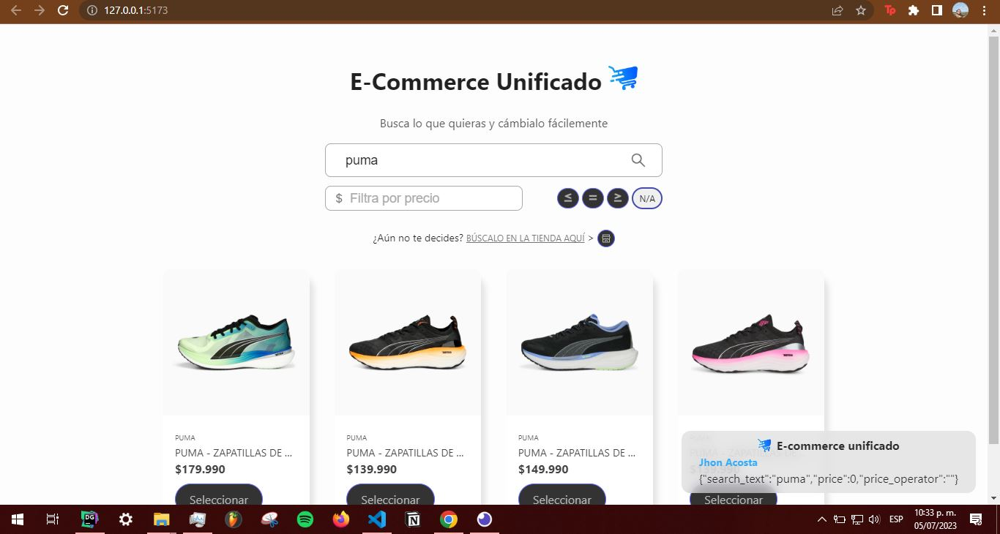

# E-commerce unificado

Unificación de productos de Shopify y Vtex por medio de NodeJs + Express, los cuales son consultados desde un cliente hecho en ReactJs.

## Tecnologías
`HTML`, `CSS`, `ReactJs`, `Redux Toolkit`, `NodeJs`, `TypeScript`, `Express`, `Sequalize`, `PostgresSql` 

## Demo link:
Accede al sitio desplegado en Vercel [google.com](https://google.com)

## Table of Content:

- [E-commerce unificado](#e-commerce-unificado)
  - [Tecnologías](#tecnologías)
  - [Demo link:](#demo-link)
  - [Table of Content:](#table-of-content)
  - [Acerca de la app](#acerca-de-la-app)
  - [Setup](#setup)
    - [Servidor](#servidor)
    - [Cliente](#cliente)
  - [Screenshots](#screenshots)
    - [Client](#client)
    - [Server Docs](#server-docs)
  - [Cómo abordé el problema](#cómo-abordé-el-problema)
  - [Status](#status)
  - [Referentes](#referentes)
  - [License](#license)

## Acerca de la app
App fullstack que unifica productos de ecommerce diferentes, como VTEX y Shopify. 

## Setup

### Servidor
- Descargar el repositorio
- Acceder a la carpeta del servidor usando `cd server/` 
- Instalar las dependencias del servidor usando `npm install`
- Crear un `.env` propio usando como referencia `./server/.env.exmaple` 
- Correr el servidor usando `nodemon` 

### Cliente
- Acceder a la carpeta del cliente usando  `cd client/` 
- Instalar las dependencias del servidor usando `npm install`
- Correr el cliente usand `npm run dev` 

## Screenshots
### Client

### Server Docs

 

## Cómo abordé el problema

Debido a que se tiene predefinida la estructura de retorno del servidor, se inició el desarrollo del cliente haciendo uso de React + Vite y se implemetó el diseño de GUI propuesto usando datos simulados. Se añadió adaptabilidad a diferentes dispositivos. Se usó Redux Toolkit con gestor de estados globales y evitar el prop-drilling.

A nivel de servidor, se investigó la implementación de la [Arquitectura Clean](https://merlino.agency/blog/clean-architecture-in-express-js-applications), y el patrón de diseño más conveniente para el problema, cuya decisión final fue el patrón [Adaptador](https://refactoring.guru/design-patterns/adapter). 

También se investigó la mejor alternativa para desplegar una base de datos PostgresSQL para el alcance de la prueba, finalmente se optó por [render.com](https://render.com/))

## Status

✅ El servidor adapta los productos de Shopify y VTEX.
✅ El servidor almacena prodcutos externos en base de datos
✅ El servidor consulta propia base de datos usando filtros.
 
✅ El cliente muestra correctamente la estructura de datos esperada.
✅ El cliente se conecta con el servidor para consultar los endpoints disponibles.
✅ El Cliente permite búsqueda unificada por texto.

## Referentes

[Merlino - Clean Architecture in Express Js](https://merlino.agency/blog/clean-architecture-in-express-js-applications)
[Refactoring Guru - Adapter](https://refactoring.guru/design-patterns/adapter)
[UML Use Cases Diagram](https://www.youtube.com/watch?v=zid-MVo7M-E)

## License

MIT license @[Jhon Acosta](https://www.github.com/mcsrk)